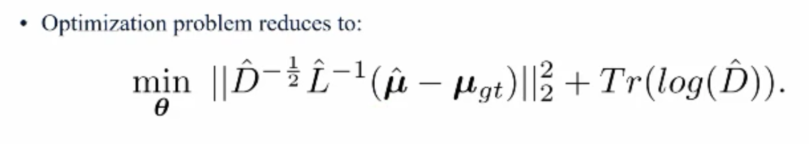

- goal is to estimate the predictive uncertainty in object detectors, so that they could be used as sensors in robotic system
- uncertainty could be quantified as the probability distribution of the object class and the bounding box corners
- problem formulation

- network architecture

- covariance regression, the highlighted term cannot be modeled since we do not have groundtruth covariance   

- to ensure sigma is PSD, force the network to learn the following

- then the loss becomes

- finally use Bayesian inference to get the distribution

- future works

