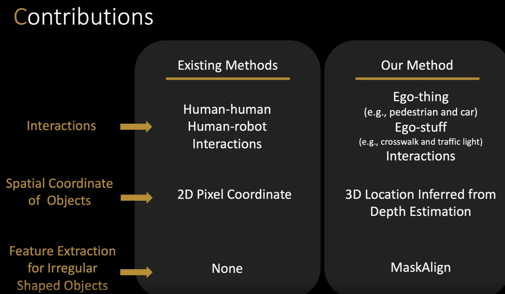
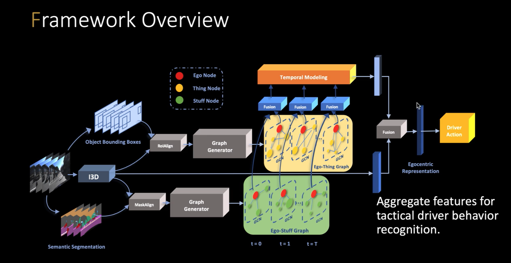
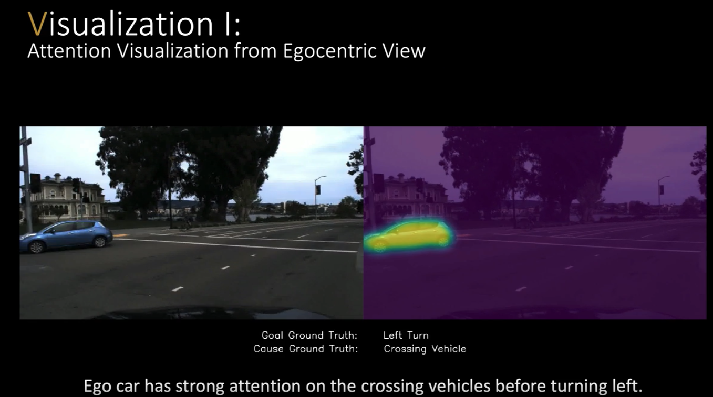

- This paper deals with understanding the interaction between human driver and pedestrians
- The goal is to learn an ego-centric spatial temporal interaction model
- Contributions

- Framework

- Experiments

