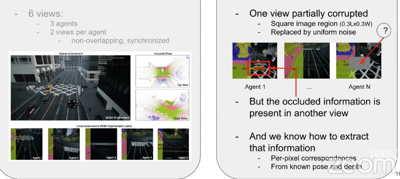
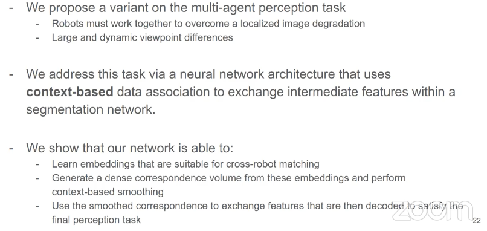

- scope

- approach

- framework

- experiments

- summary

- Q&A: since the bandwidth is limited, may only able to transmit compressed features. The algorithm is able to deal with the case when agents do not have overlap views.  
