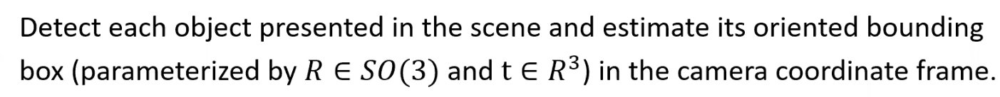
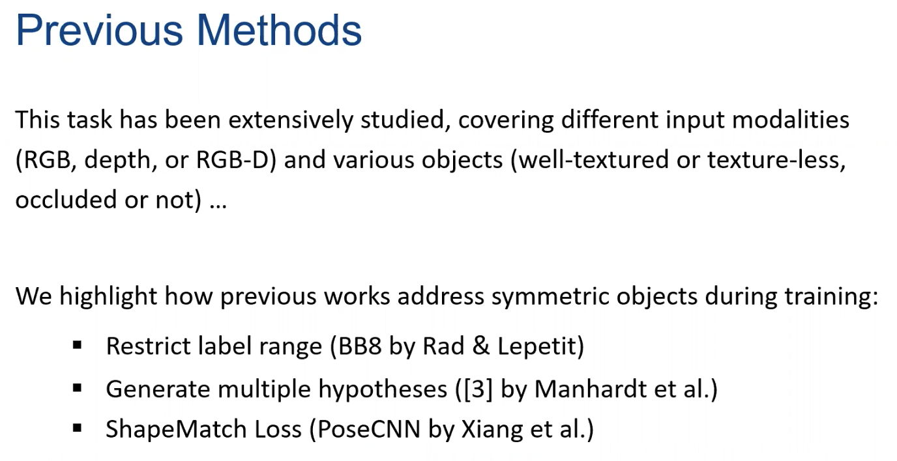
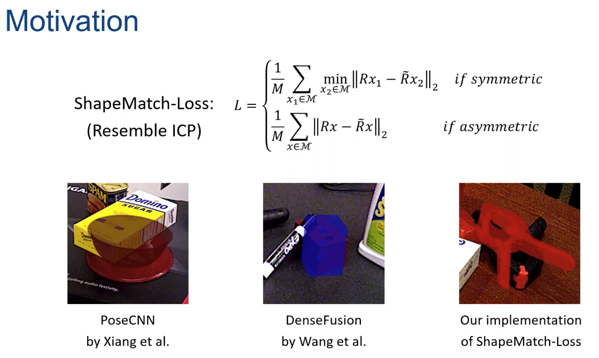
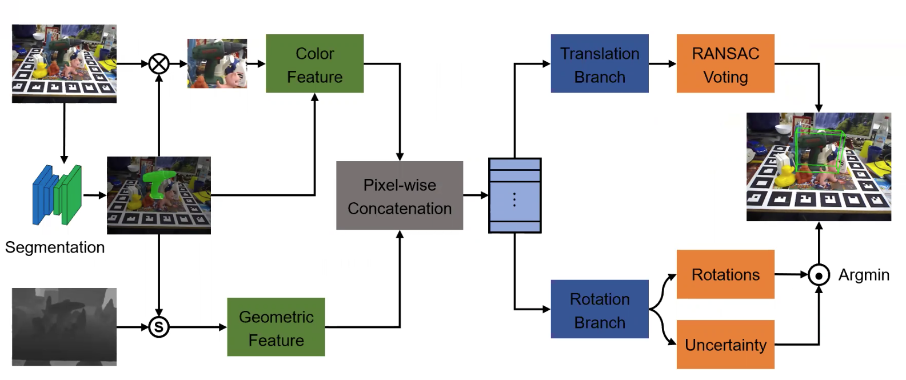
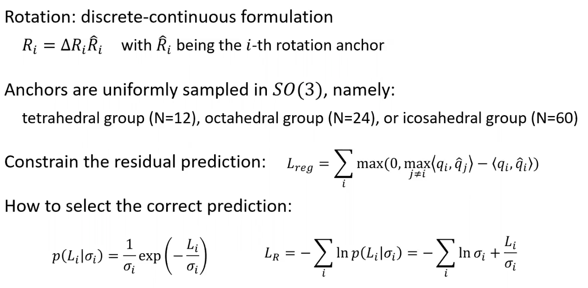
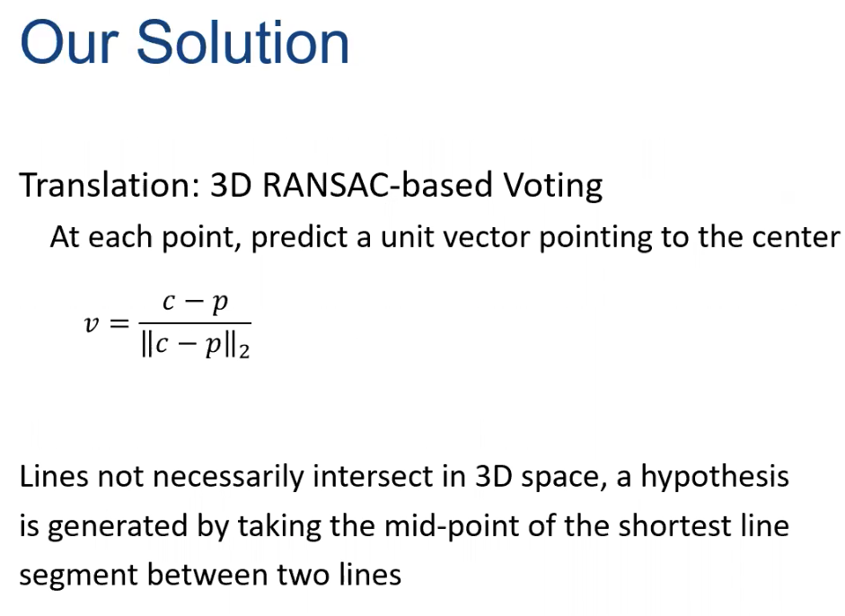
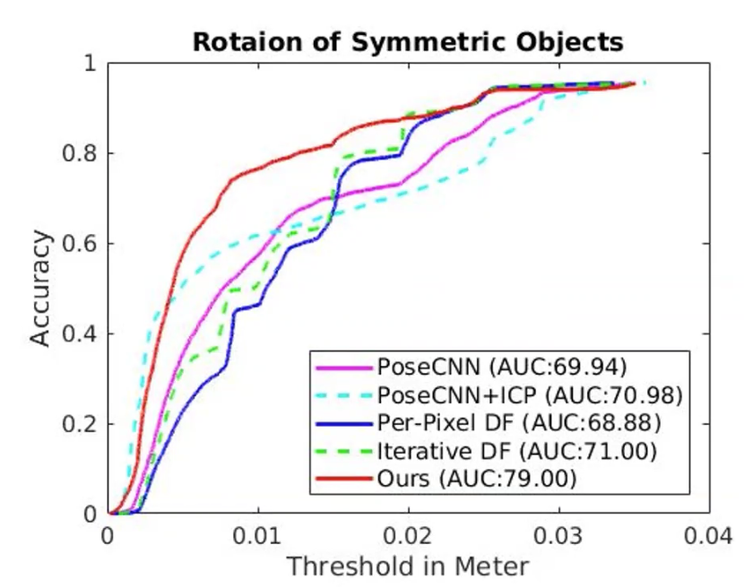

- objective is to predict object pose using RGBD sensor

- review

- if object is symmetric, ICP-like shape match loss won't work

- approach

- for rotation

- for translation

- experiment

