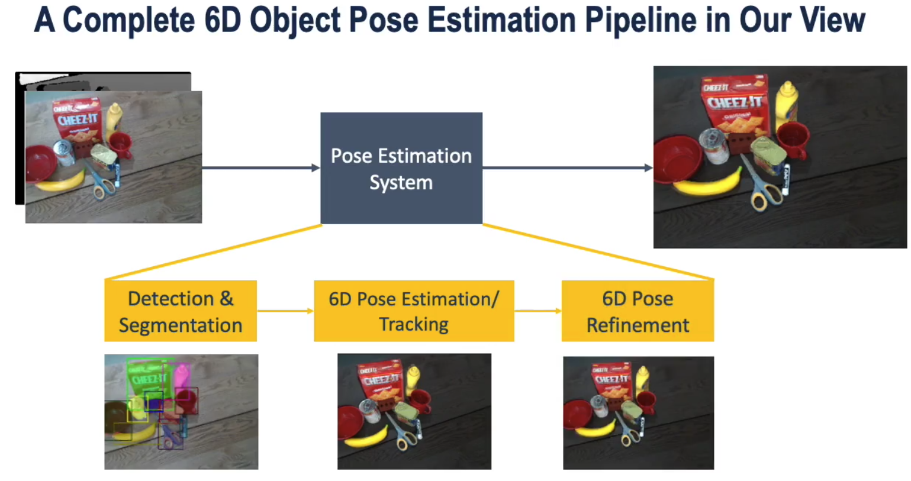
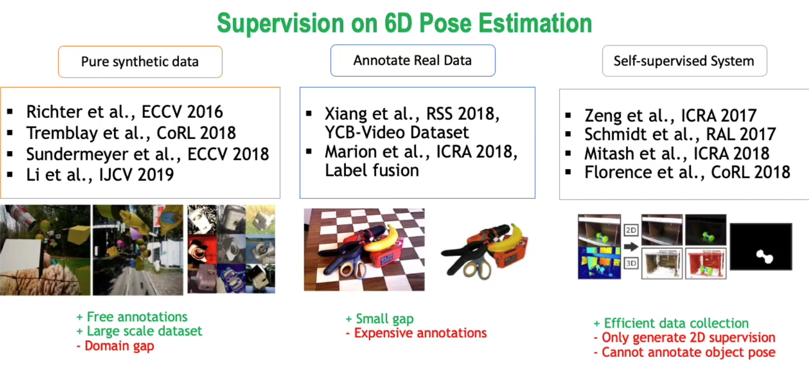
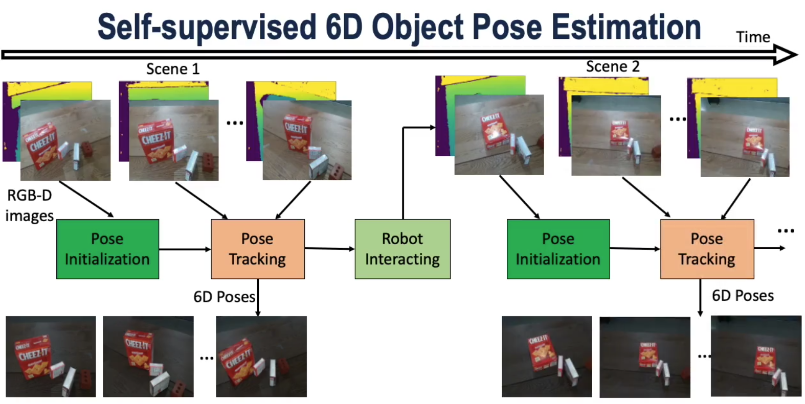
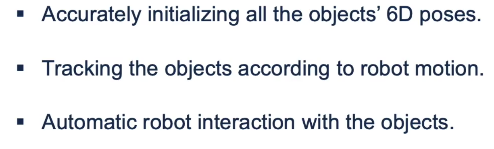
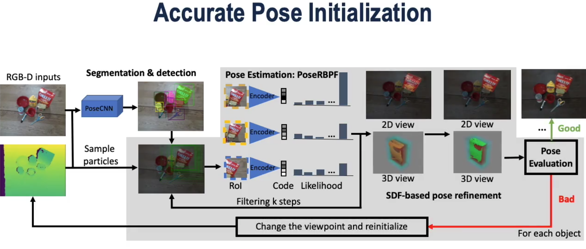
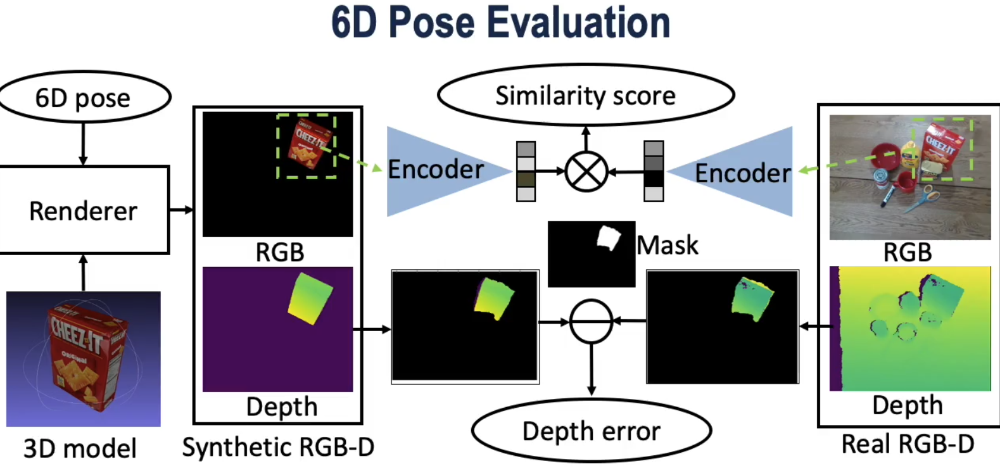
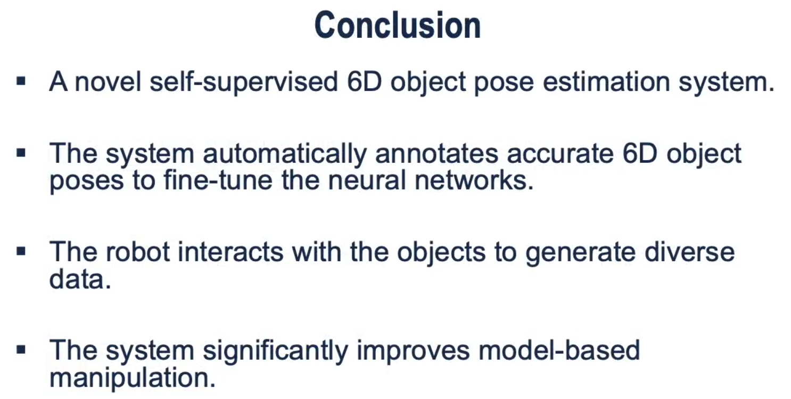

- goal is vision based object pose estimation
- review

- recently, end to end approaches are proposed, however, there is domain gap between training data and real data

- overview of this paper's approach

- key ideas

- details

- summary

