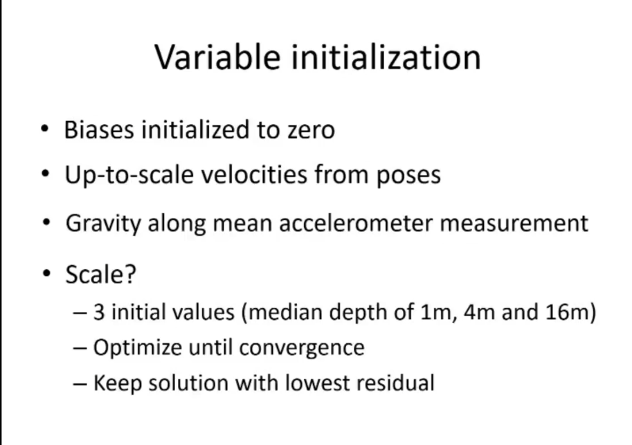
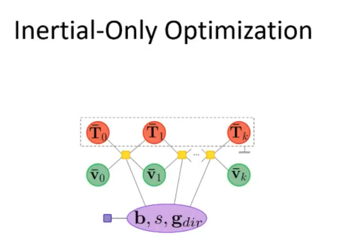
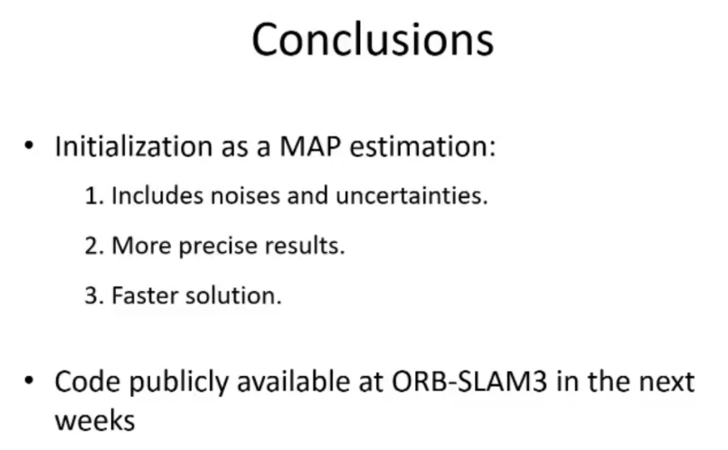

To initialize VIO, we need to compute
- true scale trajectory, 3D points
- IMU parameters
This approach is error prone because uncertainty is not taken into account

This paper's approach
- Visual only MAP estimation using ORB SLAM to obtain trajectory up to scale
- Inertial only estimation, to obtain inertial parameters
- Visual inertial MAP estimation to refine

Contributions
- Inertial initialization stated as MAP problem
- Measurement noise is considered
- Solve for all inertial parameters at once
- No assumption about inertial bias or attitude
- Prior beliefs included

Details
- Visual only MAP = BA  

- We fix the camera poses from previous step, then include inertial measurements, to estimate scale, gravity direction, biases, velocities

- Use some initial values, then do LM

Experiments
- better initialization then VINS mono on EuRoC
- Code will be available

