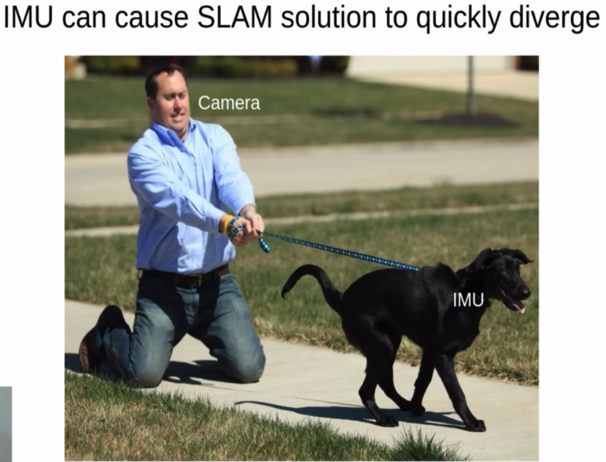

This paper addresses the scale estmation in monocular SLAM.

Drawbacks for VIO:
- Biases are hard to estiamte, and any error in bias estimation will be double-integrated into the camera positions. Thus, IMU can cause the SLAM to diverge

- Scale can only be observable via acceleration, but acceleration may be dangerous in cluttered environments 

Drawbacks for end to end pose regression:
- Geometric constraints, eg epipolar geometry are ignored

This paper's approach
- Use unscaled Mono SLAM
- Estimate metric depth for landmarks via CNNs

Details
- Depth predictor is based on residual pyramid network
- The network predicts the disparity maps  
- Loss: photometric loss + smoothness loss + left-right loss + supervised loss
- We can add depth as prior to landmarks in the factor graph, however since we are using sliding window, this depth information can only be added to a short period of the trajectory, leading to numerical instability
- The paper uses a global Sim3 pose graph and a local VO, the local VO outputs an unscaled keyframe to the global Sim3 pose graph, and the Sim3 pose graph will add a scale to the keyframe. The scaled keyframe can correct the scale in the local VO  

Experiments
- KITTI
- Data from a handheld sensor compared with ORB SLAM  
