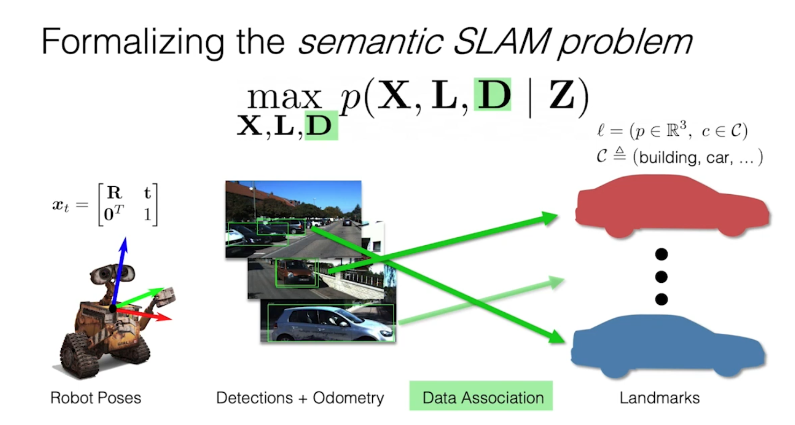
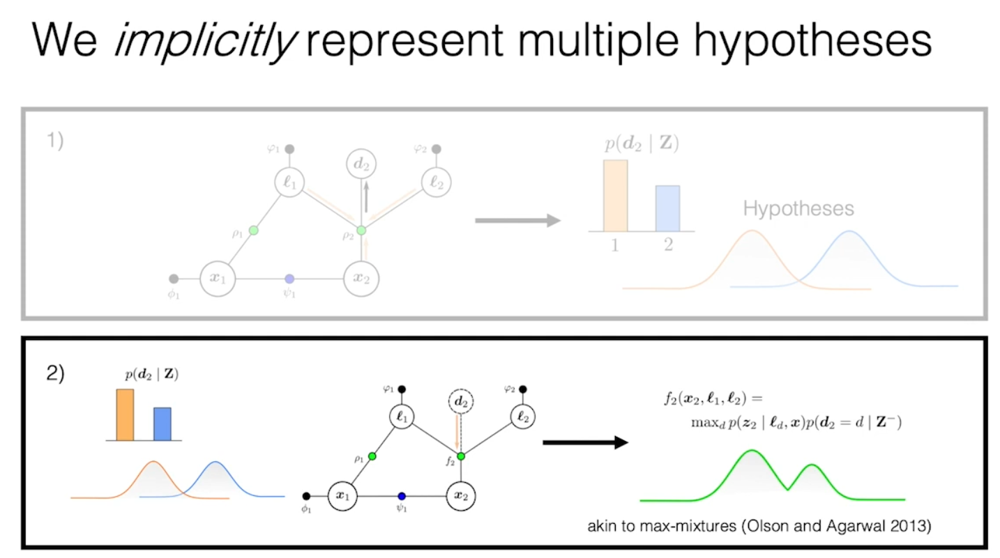

- humans often rely on semantic information for navigation
- however, real scene may be different from the training set
- eg object detectors can be ambiguous in cluttered scenes, and can fail unpredictably
- problem formulation

- the difficulty is that the hypothesis grows exponentially, we can use MLE and simply select the most probable one
- soft data association

