- goal is to model both static and dynamic objects in SLAM
- review: 1. treat dynamic objects as outliers 2. detect and track dynamic objects separately
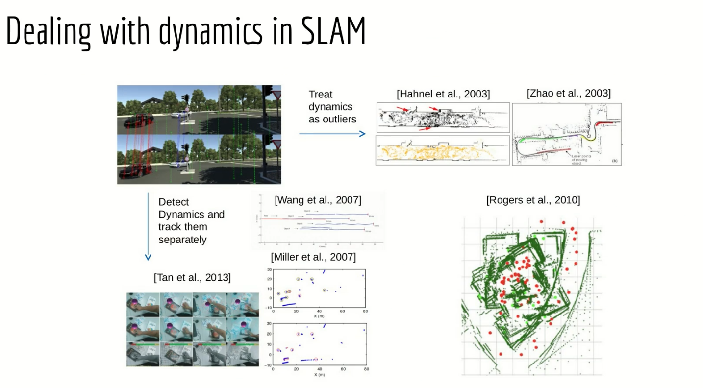
- approach
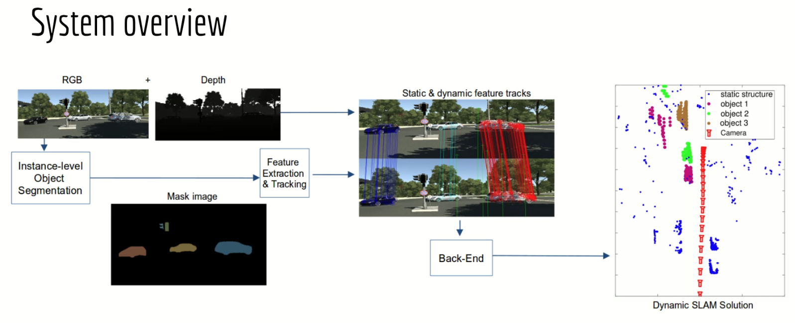
- the paper uses a feature based SLAM instead of object SLAM, since objet SLAM needs to have the 3D object models available
- the motion of the object in the world frame is expressed as the motion of the points
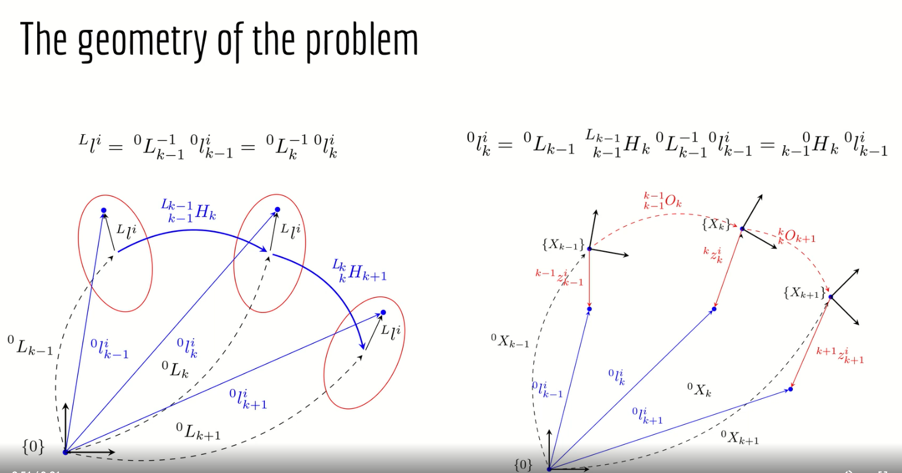
- factor graph
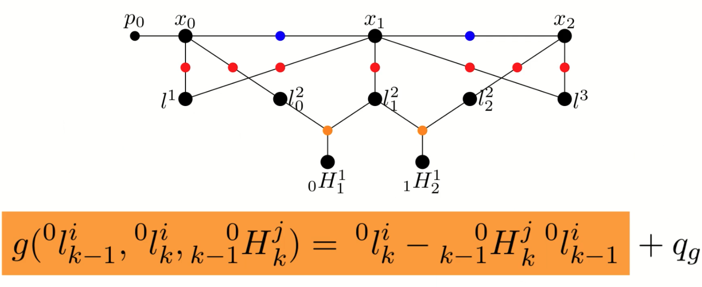
- object velocity estimation
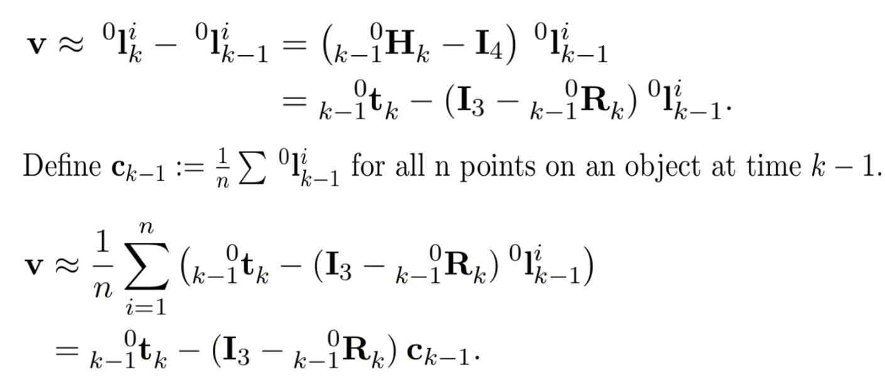
- feature tracking, optical flow is better  
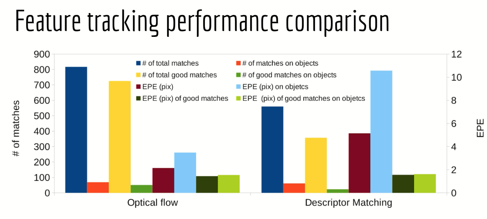
- front end on virtual KITTI
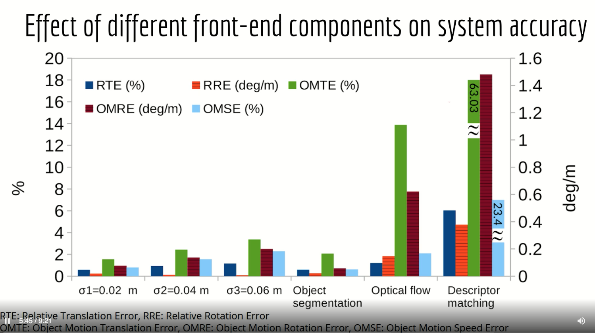
- results on KITTI
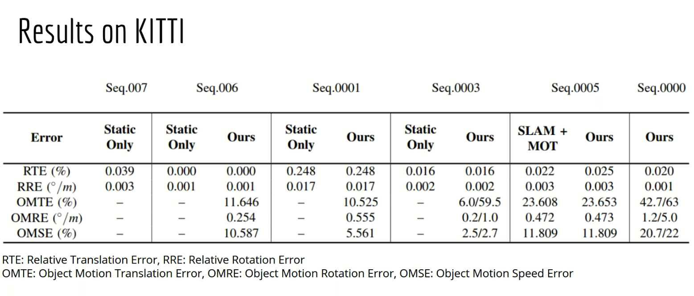
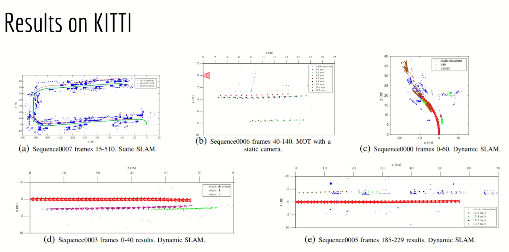
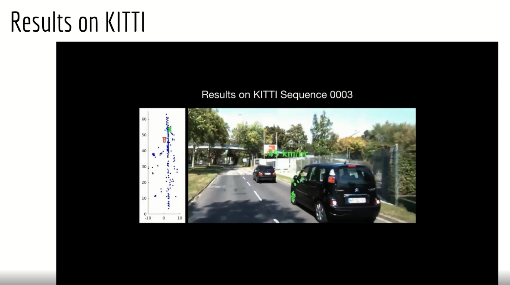
- summary
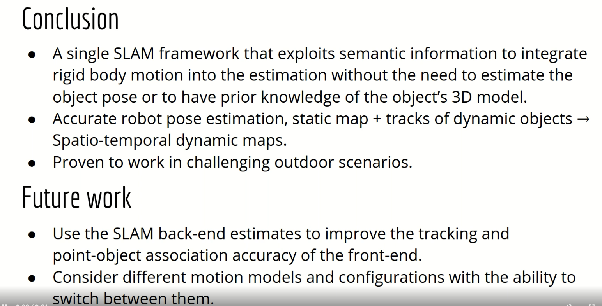
