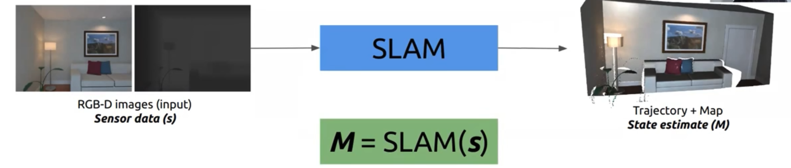
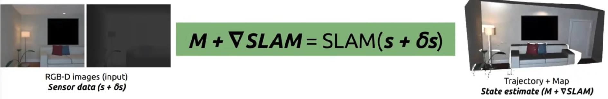
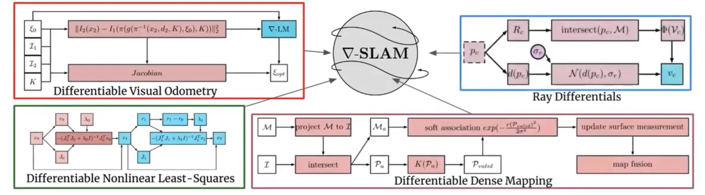
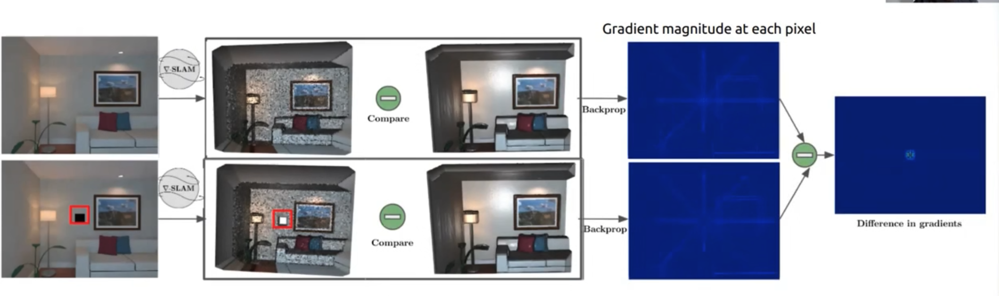
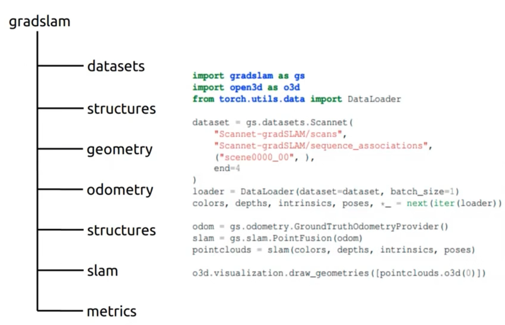

- goal is end to end RGBD SLAM
- approach

- details

- the paper uses differentiable LM, differentiable raycasting via discrete approximation, and differentiable mapping by using soft association
- application, predict missing depth

- modular codebase 

