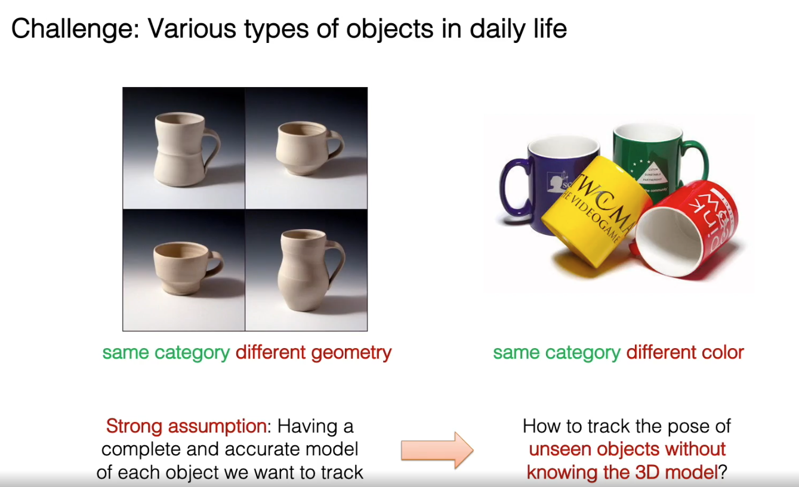

- goal is to estimate object pose
- review  

- approach

- experiments
- 6-pack is better than NOCS, since NOCS relies on object detection while 6-pack generates the anchor and enforces temporal consistency

- keypoint generation, some difficult keypoints can be inferred by more salient keypoints

- summary

