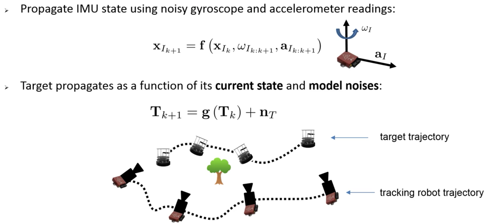
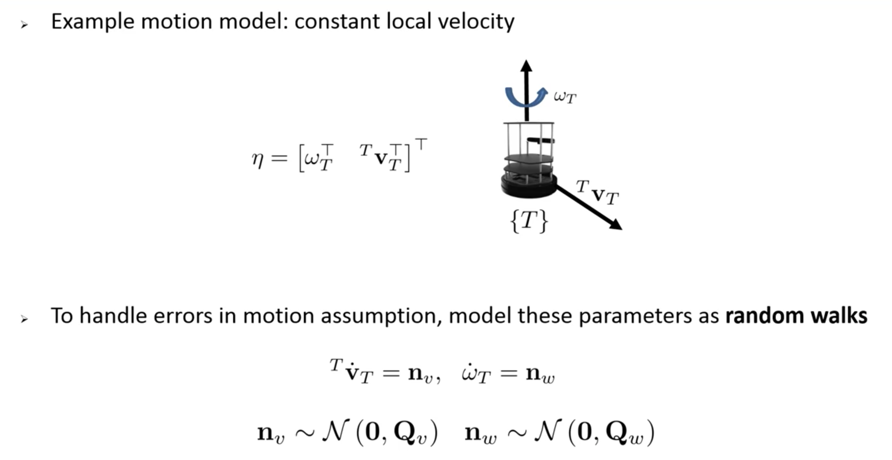
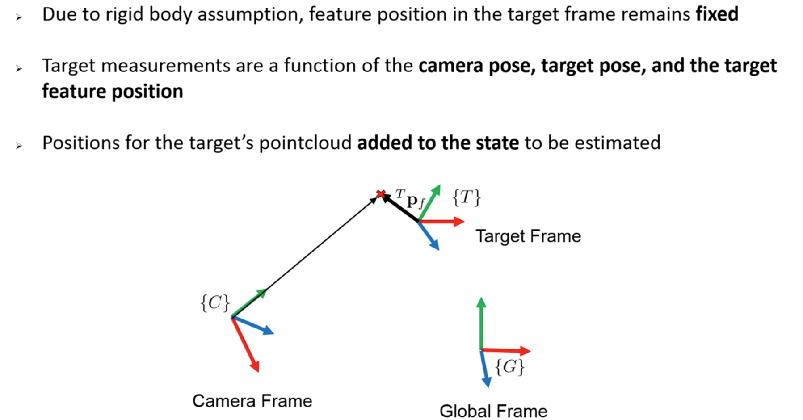
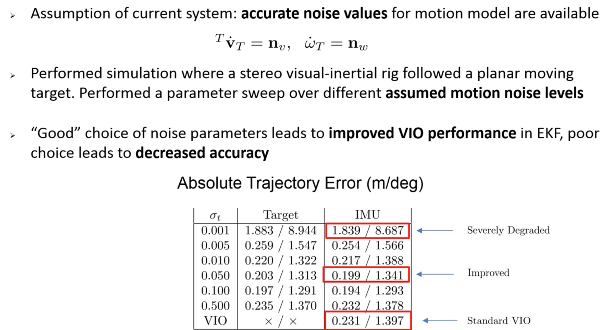
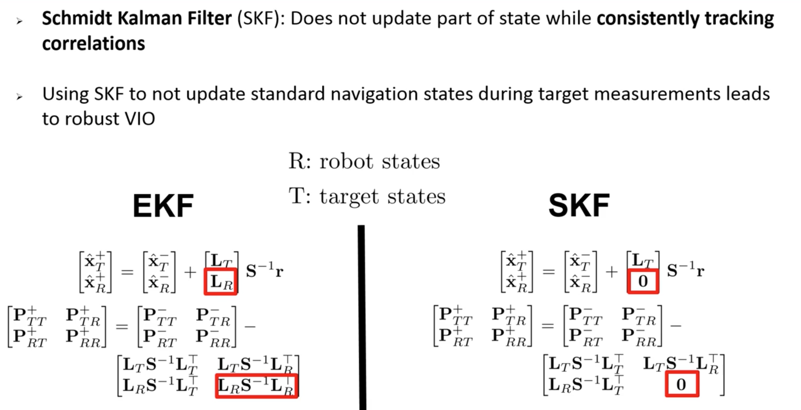
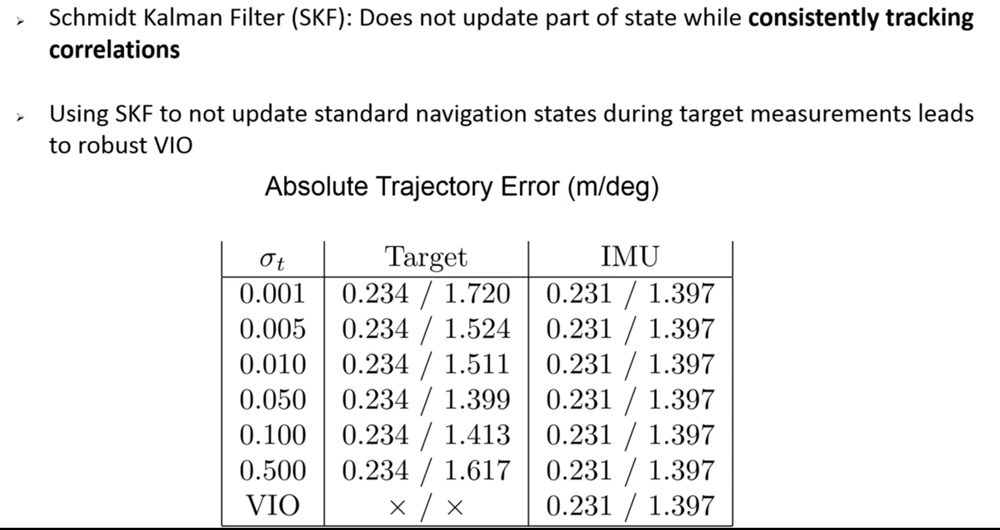
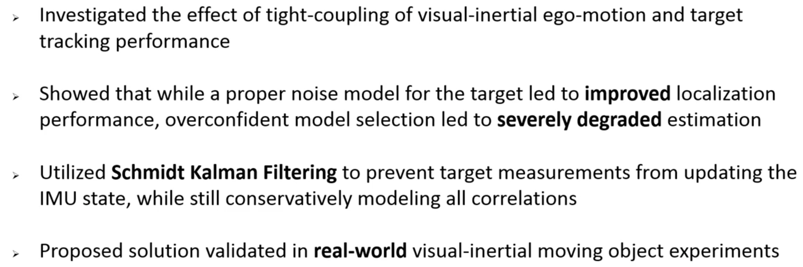
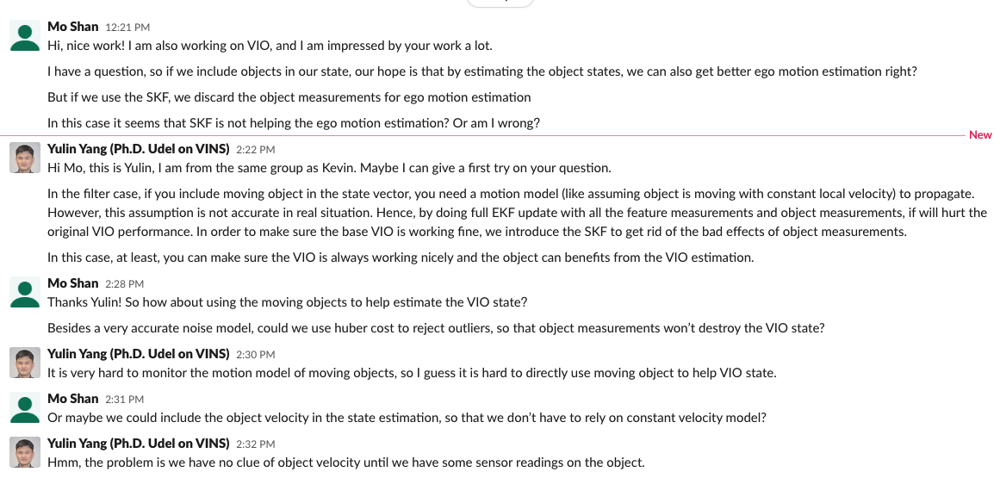
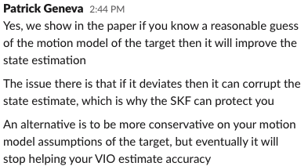

- goal is to track ego motion and moving objects using VIO
- problem formulation

- propagation

- motion model

- update

- noise model

- since we may not know the suitable noise model, we need to use SKF

- since IMU is not drifting, even if we do not have accurate noise model, target tracking is still robust

- conclusion

- Q&A:

